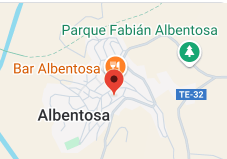

## Cómo llegar

Situada en Albentosa, un pequeño pueblo turolense de la comarca Gúdar-Javalambre, donde te sentirás como en casa.

Se encuentra a 50 Km de Teruel y cerca de Mora de Rubielos y Rubielos de Mora. A 35 Km en Arcos de las Salinas, se encuentra el centro de difusión y práctica de Astronomía "Galáctica" en el que podemos realizar visitas guiadas y actividades variadas, Contamos con las pistas de esquí de Valdelinares y Javalambre situadas a 50 y 45 km respectivamente.

Puedes localizarnos usando este plano: 

¡Te esperamos!
